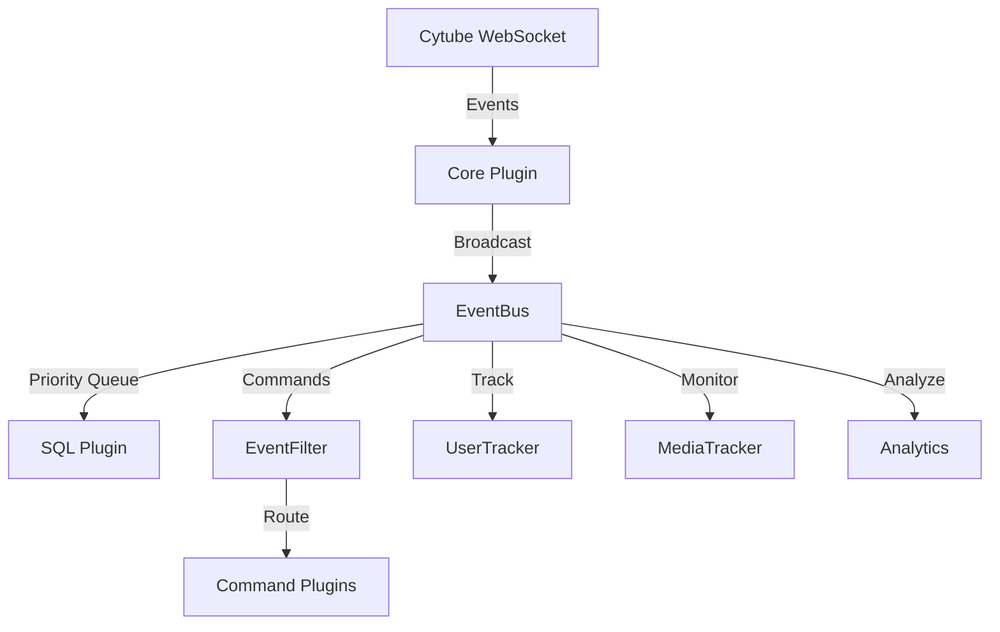

<div align="center">
  
  
  <sub><i>AI-slop portrait of Dazza, a former brash bogan-flavored chatbot that lead to the development of Daz.</i></sub>
  
  # Daz - Modular Cytube Chat Bot
  
  [](https://golang.org/)
  [](https://www.postgresql.org/)
  [](LICENSE)
  [](https://github.com/hildolfr/daz/actions)
  [](http://makeapullrequest.com)
  
  *🚀 A resilient, plugin-based chat bot for Cytube channels built with Go*
  
  ### 🌟 The Ultimate Cytube Companion Bot
</div>

---

<div align="center">
  
  ### ⚡ Lightning Fast • 🛡️ Rock Solid • 🎨 Infinitely Extensible
  
</div>

---

## 🎯 Overview

**Daz** is not just another chat bot – it's a powerhouse modular system designed for [Cytube](https://cytu.be) channels. Built with Go for blazing performance, featuring a robust plugin architecture, enterprise-grade PostgreSQL persistence, and seamless multi-room support. Whether you're managing a single channel or orchestrating multiple rooms, Daz delivers unmatched flexibility and reliability.

## ✨ Why Daz?

<table>
<tr>
<td width="50%">

### 🚀 **Performance First**
- Event-driven architecture with priority queuing
- Non-blocking message delivery
- Optimized for thousands of events per second

### 🔌 **Infinitely Extensible**
- Drop-in plugin system
- Clean API for custom functionality
- Hot-swappable configurations

</td>
<td width="50%">

### 🛡️ **Built to Last**
- Automatic reconnection with exponential backoff
- Persistent retry mechanisms
- Zero data loss on restarts

### 📊 **Intelligence Built-In**
- Real-time analytics and tracking
- User behavior monitoring
- Media play statistics

</td>
</tr>
</table>

## 🎯 Core Features

> **"Daz doesn't just connect to Cytube – it transforms your channel experience"**

- **🏠 Multi-Room Mastery** - Seamlessly manage multiple Cytube channels from a single instance
- **🗄️ PostgreSQL Power** - Enterprise-grade data persistence for events, users, and media
- **🎮 Smart Commands** - Intelligent command framework with cooldowns, permissions, and aliases
- **📈 Live Analytics** - Real-time insights into your channel's activity and health
- **🔄 Self-Healing** - Automatic recovery from failures with persistent retry queues
- **⚡ Lightning Fast** - Handles thousands of events per second without breaking a sweat
- **🛡️ Rock Solid** - Production-tested reliability with comprehensive error handling
- **📡 Health Monitoring** - Built-in health checks and Prometheus metrics for observability

## 🚀 Quick Start

### Prerequisites

- Go 1.23 or higher
- PostgreSQL 14 or higher
- Network access to Cytube servers

### Installation

1. **Clone the repository**
   ```bash
   git clone https://github.com/hildolfr/daz.git
   cd daz
   ```

2. **Set up the database**
   ```bash
   createdb daz
   createuser ***REMOVED***
   # Grant permissions as needed
   ```

3. **Configure Daz**
   ```bash
   cp config.json.example config.json
   # Edit config.json with your settings
   ```

4. **Build and run**
   ```bash
   make build
   ./bin/daz
   ```

## 🔧 Configuration

Daz uses a JSON configuration file. Here's a minimal example:

```json
{
  "core": {
    "rooms": [{
      "channel": "your-channel-name",
      "username": "bot-username",
      "password": "bot-password",
      "enabled": true
    }],
    "database": {
      "host": "localhost",
      "port": 5432,
      "database": "daz",
      "user": "***REMOVED***",
      "password": "your-db-password"
    }
  },
  "plugins": {
    "eventfilter": {
      "command_prefix": "!"
    }
  }
}
```

See [config.json.example](config.json.example) for a complete configuration reference.

## 🏗️ Architecture

<div align="center">



</div>

Daz's event-driven architecture ensures maximum performance and reliability:

- **⚡ Core Plugin** - Lightning-fast WebSocket connections to Cytube
- **🚦 EventBus** - High-performance message broker with priority queuing
- **🧩 Plugin System** - Drop-in components for endless customization
- **💾 SQL Plugin** - Enterprise-grade PostgreSQL persistence

> 📖 For the complete architecture deep-dive, see [daz-chatbot-architecture.md](daz-chatbot-architecture.md)

## 📦 Built-in Plugins

### Core Plugins
- **SQL** - Database operations and event logging
- **EventFilter** - Event routing and command detection
- **Retry** - Persistent retry mechanism for failed operations

### Feature Plugins
- **UserTracker** - Track user sessions and activity
- **MediaTracker** - Monitor media plays and queue changes
- **Analytics** - Aggregate statistics and reporting

### Command Plugins
- **!help** - Display available commands
- **!about** - Show bot information
- **!uptime** - Report bot uptime
- **!debug** - Debug information (admin only)

## 🛠️ Development

### Building from Source

```bash
# Run tests
make test

# Format code
make fmt

# Run linters
make lint

# Build binary
make build
```

### Creating a Plugin

1. Implement the `framework.Plugin` interface
2. Register event handlers with the EventBus
3. Add configuration schema
4. Register in `main.go`

Example plugin structure:
```go
type MyPlugin struct {
    eventBus framework.EventBus
    config   MyPluginConfig
}

func (p *MyPlugin) Init(eventBus framework.EventBus, config json.RawMessage) error {
    p.eventBus = eventBus
    // Parse config, subscribe to events
    return nil
}
```

## 🚀 Deployment

### Systemd Service

```bash
# Copy the service file
sudo cp scripts/daz.service /etc/systemd/system/

# Enable and start the service
sudo systemctl enable daz
sudo systemctl start daz

# Check status
sudo systemctl status daz
```

### Manual Deployment

```bash
# Run in background with logging
nohup ./bin/daz > daz.log 2>&1 &

# Or use screen/tmux for persistent sessions
screen -S daz ./bin/daz
```

## 📊 Monitoring

Daz provides health check endpoints and Prometheus metrics:

- `GET /health` - Overall system health
- `GET /health/live` - Liveness probe
- `GET /health/ready` - Readiness probe
- `GET /metrics` - Prometheus metrics

## 🤝 Contributing

We welcome contributions! Please see our [Contributing Guidelines](CONTRIBUTING.md) for details.

1. Fork the repository
2. Create your feature branch (`git checkout -b feature/amazing-feature`)
3. Commit your changes (`git commit -m 'Add amazing feature'`)
4. Push to the branch (`git push origin feature/amazing-feature`)
5. Open a Pull Request

## 📝 License

This project is licensed under the GNU General Public License v3.0 - see the [LICENSE](LICENSE) file for details.

```
Daz - Modular Cytube Chat Bot
Copyright (C) 2025 The Daz Contributors

This program is free software: you can redistribute it and/or modify
it under the terms of the GNU General Public License as published by
the Free Software Foundation, either version 3 of the License, or
(at your option) any later version.
```

## 🙏 Acknowledgments

- The Cytube community for their platform
- All contributors who have helped shape Daz
- The Go community for excellent libraries and tools

## 📚 Documentation

- [Architecture Guide](daz-chatbot-architecture.md)
- [Configuration Reference](config.json.example)
- [API Documentation](docs/api.md) *(coming soon)*
- [Plugin Development Guide](docs/plugins.md) *(coming soon)*

## 💬 Support

- **Issues**: [GitHub Issues](https://github.com/hildolfr/daz/issues)
- **Discussions**: [GitHub Discussions](https://github.com/hildolfr/daz/discussions)

---

<div align="center">

### 🌟 Join the Daz Revolution!

**Daz** is transforming how Cytube channels operate. Be part of something amazing.

[](https://github.com/hildolfr/daz/stargazers)
[](https://github.com/hildolfr/daz/network/members)
[](https://github.com/hildolfr/daz/subscription)

Made with ❤️ by the Daz community

</div>